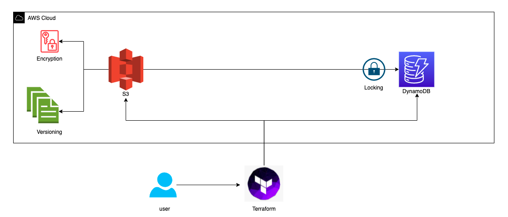

# Terraform remote backend on AWS

> This project will deploy a S3 Bucket and a DynamoDb Table on AWS Cloud to be used for Terraform Backend and lock managment.

## 🚀 Table of Contents
  * [General Info](#general-information)
  * [Technologies Used](#technologies-used)
  * [Features](#features)
  * [Screenshots](#screenshots)
  * [Setup](#setup)
  * [Usage](#usage)
  * [Project Status](#project-status)
  * [Room for Improvement](#room-for-improvement)
  * [Acknowledgements](#acknowledgements)
  * [Contact](#contact)

___

## 📋  General Information
  - Provide general information about your project here.
  - What problem does it (intend to) solve?
  - What is the purpose of your project?
  - Why did you undertake it?


<!-- You don't have to answer all the questions - just the ones relevant to your project. -->
___

## 🛠️ Technologies Used
  - Tech 1 - Terraform 1.2.1
  - Tech 2 - Terraform Providers
    - AWS 2.0
  - Tech 3 - AWS ClI
  - Tech 4 - AWS S3
  - Tech 5 - AWS DynamoDB 
___

## 📦 Features
  - the S3 Bucket will be encrypted
  - the S3 Bucket will be versioned 
  - DyanmoDb table will be managing to terraform locking
___

## 💻 Setup
  What are the project requirements/dependencies? 
  Where are they listed? 
  A requirements.txt or a Pipfile.lock file perhaps? 
  Where is it located?
  Proceed to describe how to install / 
  setup one's local environment / 
  get started with the project.
___

## 📌 Usage
How does one go about using it?
Provide various use cases and code examples here.

  * Rename the file from "example.tfvars_" to something more suited like "resources.tfvars"
  * When you apply the terraform don't forget to pass this file as a var-file argument
  <!-- Code Blocks -->
  ```bash
    terraform init
    terraform plan -var-file resources.tfvars
  ``` 
  * The same will apply if you want to destroy
  <!-- Code Blocks -->
  ```bash
    terraform destroy -var-file resources.tfvars
  ``` 
___

## 🔍 Project Status
Project Status: _in progress_
___

## 📈  Room for Improvement
  - Improvement to be done 1
  - Improvement to be done 2

___
## 📝 TO-DO ##
  <!-- Lista de Tarefas -->
  * [x] Task 1
  * [x] Task 2
  * [ ] Task 3
    * [ ] 
    * [ ] 

---
## 📑 Oficial Documentation ##
   * [Terraform](https://www.terraform.io/docs)

---
## 🌐 Links ##
   * [Confluence](https://bairesdev.atlassian.net/wiki/spaces/CG/overview)
   * [GitLab](https://svlp-susemgr01.pgr.mpf.mp.br/)
   * [StackOverFlow](https://stackoverflow.com/c/bairesdev/questions)

---
## 📚 Bibliografia ##
   1. [Terraform Best Practices](https://www.terraform-best-practices.com/)
   2. 

---
## 🎁 Acknowledgements    
  - This project was inspired by [this documentation](https://www.terraform.io/language/settings/backends/s3).
  - This project was based on [this tutorial](https://www.terraform.io/language/settings/backends/s3).

---

## 📲 Contact
- Created by [@your_favaorite_admin](admin@sample-domain.io) - feel free to contact me!
---
